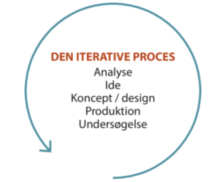
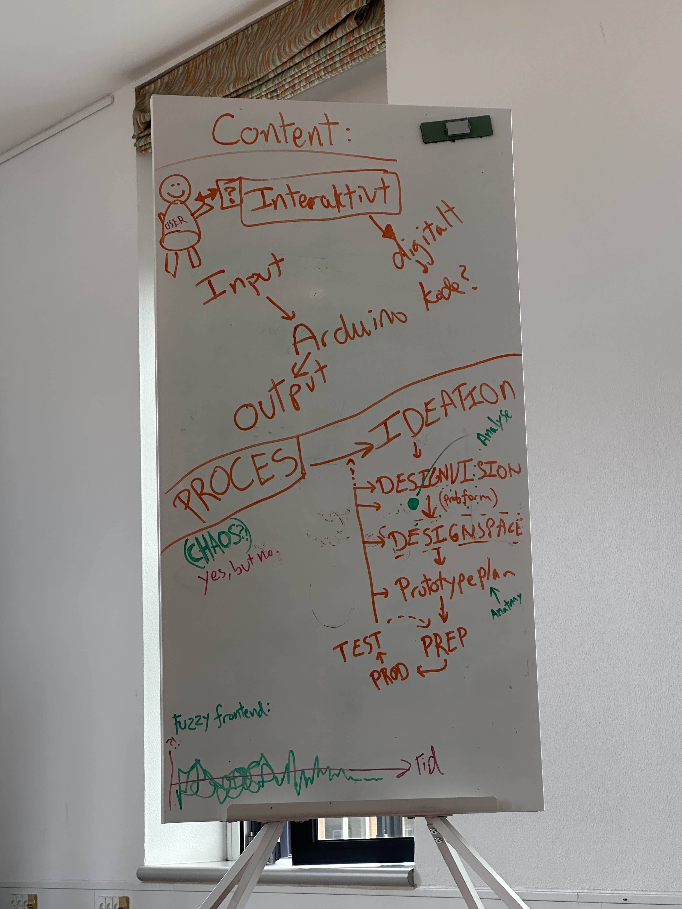
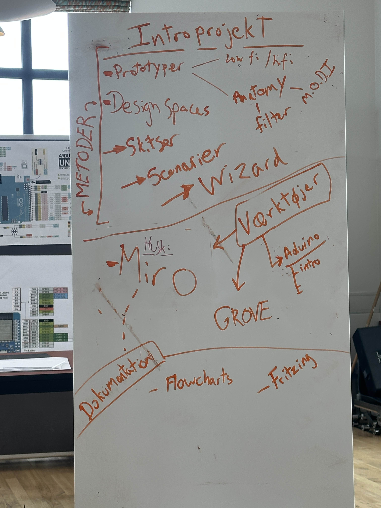

# DDU
Noter til DDU på HTX

## faser som ingeniør:
1. Forberedelse
2. Produktion
3. Test
Fungerer godt hvis processen er linier, men er ikke så godt i DDU/software-udvikling, hvor der er mange prototyper (iterativ proces)
I stedet laver man små fremskridt og prototyper og tester.

Man bliver sansynligvis ikke færdig med sit produkt i DDU, man går bare i gennem en masse prototyper (iterativ proces) og forsøger at gøre det bedre.

## How to read a paper
Tips til hvordan man læser et research paper

### The first pass
Få et hurtigt overblik over den resultatet.
Dette tager ca. 10 min.

1. Carefully read the title, abstract, and introduction

2. Read the section and sub-section headings, but ignore
everything else

3. Read the conclusions

4. Glance over the references, mentally ticking off the
ones you’ve already read

At the end of the first pass, you should be able to answer
the five Cs:
1. Category: What type of paper is this? A measure-
ment paper? An analysis of an existing system? A
description of a research prototype?

2. Context: Which other papers is it related to? Which
theoretical bases were used to analyze the problem?

3. Correctness: Do the assumptions appear to be valid?

4. Contributions: What are the paper’s main contribu-
tions?

5. Clarity: Is the paper well written?

### The second pass
Her læser man lidt mere, men går ikke i detaljer. Det kan være godt at tage noter løbene.
Kig på grafer og illustrationer. Er de korrekt sat op?
Dette tager ca. en time.

1. Look carefully at the figures, diagrams and other illus-
trations in the paper. Pay special attention to graphs.
Are the axes properly labeled? Are results shown with
error bars, so that conclusions are statistically sig-
nificant? Common mistakes like these will separate
rushed, shoddy work from the truly excellent.

3. Remember to mark relevant unread references for fur-
ther reading (this is a good way to learn more about
the background of the paper).

### The third pass
Gå i dybten med teksten.
Tænk over forfatterens antagelser og overvej hvorfor de enkelte pointer giver mening.

## The Anatomy of Prototypes: Prototypes as Filters, Prototypes as Manifestations of Design Ideas

Fundamental prototyping principle:
Prototyping is an activity with the purpose of creating a manifestation that, in its simplest
form, filters the qualities in which designers are interested, without distorting the
understanding of the whole.

Economic principle of prototyping:
The best prototype is one that, in the simplest and the most efficient way, makes the possibilities
and limitations of a design idea visible and measurable.

Anatomy of prototypes:
Prototypes are filters that traverse a design space and are manifestations of design ideas that
concretize and externalize conceptual ideas.

## Introprojekt
Hvad vi har lært i dag:

Prototyper
* Lo-fi hi-fi
* Anatomy: som filter, M.o.D.I

Design spaces på Miro
* Skitser
* Scenarier
* Wizard-of-Oz

Interaktivt
* Digitalt
* Kode
* Arduino
Vilde tavle ting:

19/08/2025
Jo mere man tester designet med brugere, jo bedre. Dog skal det ikke være brugerne der bestemmer hele designet.
Hvis produktet er helt færdigt med de rigtige materiale og det hele, vil brugerne være mindre tilbøjlige til at foreslå endringer, der kunne gøre det bedre.
Derfor er det en god ide at lave en masse prototyper, hvor det fx er tejnet eller lavet af pap, hvor tingene måske kan flyttes rundt.

26/08/2025
Fritzing https://orion.moore.dk/DDU/
Software til at trække nogle klodser ind og dokumentere hardware. 

29/08/2025 Intro projekt
Guide: Disconnect alle ledninger fra arduino (bortset fra usb) før upload af kode. Sørg også for at lukke PyCharm. Upload så kode og connect ledninger igen.
Kør derefter python kode.

02/09/2025
Præsentation af introprojekt.
Pointen med anatomy of prototype er at man siger/viser, hvilke filtrer man har brugt til hvilke prototyper, så man ved hvad formålet er.

Man skal ikke nødvendigvis vise idegenerering og det alle har gjort.

Man behøver ikke brugerteste alt, nogle ting skal man også bare selv vælge.

## Projekt 2 - Embodied interaction
09/09/2025
5 temaer i "How Bodies Matter"
1. Thinking/learning through doing:
   - Epistimologi.
   - Fysisk bevægelse og læring hænger sammen.
   - Når man laver prototyper lærer man mere om sit produkt.
2. Performance:
   - Kroppen er effektiv.
   - Der er noget at hente fra interaktion med kroppen i forhold til tech
   - Acc/Gyro
   - Afstand
   - AR
   - PIR
3. Visibility
   - Man kan se hvad der foregår
   - Eksempel fra artiklen om flight control: Flyt fysisk papir, der repræsenterer fly. Selv om man laver noget andet kan man se der sker noget.
   - Man forstår en interaktion ved, at nogle andre gør det. Pga. kropslig interaktion. Dokk1 digital interaktivt bodboldspil -> man kan lære det ved at se
   - Forstå som tilskuter hvad og hvordan andre gør
4. Risk:
   - Tingene betyder noget, når der er noget på spil. Fx er det farligt, men også sjovt at køre på cykel
   - Commitment, reliability
5. Thickness of practice:
   - Øvelse -> motor memory
   - Gøre ting uden at tænke over det
   - Genkendelige aktioner (finde ud af noget nyt, når man har prøvet noget der minder om)

   
